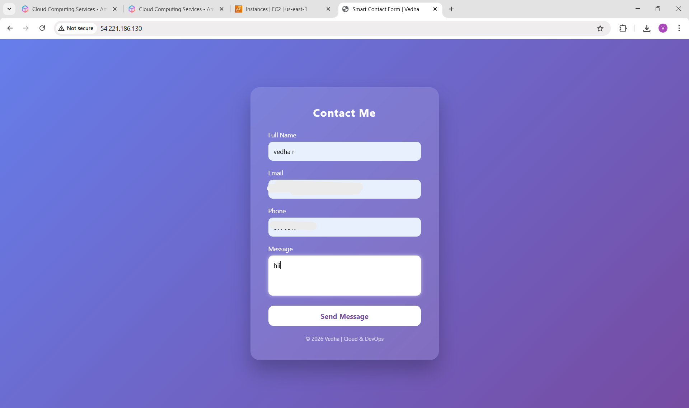

# AWS EC2 Static Website Hosting (Windows)

This project demonstrates how to host a static website on an AWS EC2 Windows instance using IIS Web Server.

## Project Overview
In this project, I launched a Windows EC2 instance in AWS and hosted a static website using IIS. The website can be accessed using the public IP address of the EC2 instance.

## AWS Services Used
- Amazon EC2 (Windows Server)
- IIS Web Server

## Steps Performed
1. Launched an EC2 Windows instance
2. Connected to the instance using Remote Desktop (RDP)
3. Installed and configured IIS Web Server
4. Uploaded static website files (HTML, CSS)
5. Accessed the website using the EC2 Public IP

## Project Output

